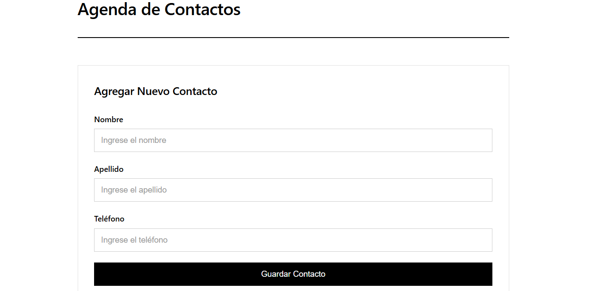
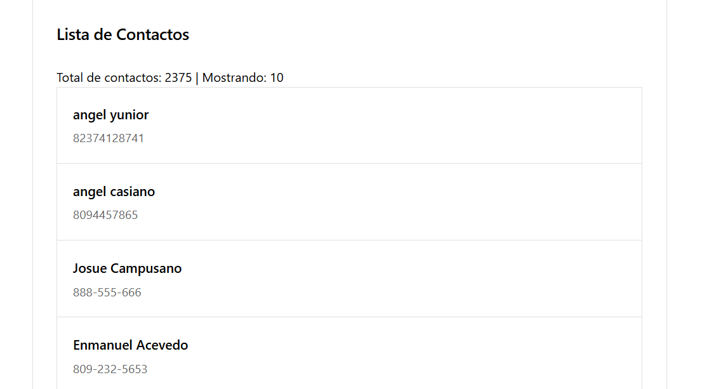

#  Servicio Web - Agenda de Contactos

**Tarea 5:** Servicio Web utilizando Express + Node.js

---

##  Descripción

Este proyecto es un servicio web que implementa las operaciones básicas de:
- ✅ **Listar contactos** (GET)
- ✅ **Agregar contactos** (POST)

El servicio funciona como intermediario entre el cliente y la API de Raydelto (`http://www.raydelto.org/agenda.php`).

---

##  Tecnologías Utilizadas

- **Node.js** - Entorno de ejecución
- **Express** - Framework web
- **node-fetch** - Para hacer peticiones HTTP

---

##  Instalación

```powershell
# 1. Clonar o descargar el proyecto
cd agenda-servicio-web

# 2. Instalar dependencias
npm install

# 3. Iniciar el servidor
npm start
```

---

##  Uso

### Iniciar el servidor

```powershell
npm start
```

El servidor se iniciará en: `http://localhost:3000`

### Probar con el navegador

1. Inicia el servidor con `npm start`
2. Abre `test.html` en tu navegador
3. Prueba agregar y listar contactos

---

##  Endpoints del API

### 1. Información del Servicio
```
GET http://localhost:3000/
```

### 2. Listar Contactos
```
GET http://localhost:3000/contactos
```

**Respuesta:**
```json
{
  "success": true,
  "mensaje": "Contactos obtenidos exitosamente",
  "cantidad": 150,
  "contactos": [...]
}
```

### 3. Agregar Contacto
```
POST http://localhost:3000/contactos
Content-Type: application/json

{
  "nombre": "Juan",
  "apellido": "Pérez",
  "telefono": "809-555-1234"
}
```

**Respuesta:**
```json
{
  "success": true,
  "mensaje": "Contacto agregado exitosamente",
  "contacto": {
    "nombre": "Juan",
    "apellido": "Pérez",
    "telefono": "809-555-1234"
  }
}
```

---

##  Probar con cURL

```powershell
# Listar contactos
curl http://localhost:3000/contactos

# Agregar contacto
curl -X POST http://localhost:3000/contactos -H "Content-Type: application/json" -d "{\"nombre\":\"Juan\",\"apellido\":\"Perez\",\"telefono\":\"809-555-1234\"}"
```

---

##  Estructura del Proyecto

```
agenda-servicio-web/
├── node_modules/
├── server.js          # Servidor Express
├── test.html          # Interfaz de prueba
├── package.json       # Configuración del proyecto
├── package-lock.json
└── README.md          # Este archivo
```

---

## ✅ Características

- ✅ Servidor Express funcional
- ✅ CORS habilitado
- ✅ Validación de datos
- ✅ Manejo de errores
- ✅ Logging de peticiones
- ✅ Interfaz de prueba incluida
- ✅ Código comentado y documentado

---

##  Tarea Completada

Este proyecto cumple con todos los requisitos de la tarea:

1. ✅ Servicio Web con Express
2. ✅ Operación GET para listar contactos
3. ✅ Operación POST para agregar contactos
4. ✅ Utiliza la API de http://www.raydelto.org/agenda.php


## Vista del Proyecto

### Formulario para Agregar Contactos


### Lista de Contactos

